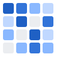

<div align="center">
  
  <h1>Calendar Heatmap Panel</h1>

[](https://opensource.org/licenses/MIT)
[](https://grafana.com)
[](https://nodejs.org/)
[](https://www.typescriptlang.org/)
</div>

---

A Grafana panel plugin that renders time-series data as an interactive calendar heatmap inspired by GitHub contribution graphs.

- **Plugin ID:** `tim012432-calendarheatmap-panel`
- **Author:** Tim0_12432
- **Version:** 1.0.4

## 🌟 Features

### Core

- GitHub-style calendar visualization for daily time-series values
- Six built-in color schemes: Green, Blue, Red, Yellow, Purple, Orange
- Five aggregation methods: Sum, Count, Average, Maximum, Minimum
- Auto-sizing cells to fit the available panel width
- Theme-aware rendering for Grafana light and dark modes
- Interactive tooltips with formatted date and value

### Customization

- Cell size (8–20 px), spacing (1–24 px), and corner radius (0–6 px)
- Optional week-day labels, month labels, and legend
- Toggle tooltips and choose aggregation per panel

### Data Handling

- Efficient daily aggregation for large time ranges
- Real-time updates driven by Grafana time range refresh
- Works with any data source that returns timestamp + numeric value

## 🔧 Requirements

- Grafana **11.6.0+**
- Node.js **22+** and npm for local development

## 🚀 Installation

### Grafana Catalog (recommended)

_Plugin is pending Grafana catalog publication. Use manual installation until approved._

### Grafana CLI

```bash
grafana-cli plugins install tim012432-calendarheatmap-panel
```

Restart Grafana after installation.

### Manual Download

1. Download the latest release from [GitHub Releases](https://github.com/tim0-12432/calendar-heatmap-panel/releases).
2. Extract the archive into your Grafana plugins directory:
   - Linux/Docker: `/var/lib/grafana/plugins/`
   - Windows: `data/plugins/`
3. Restart Grafana and verify under **Administration → Plugins**.

### Development Install (from source)

```bash
git clone https://github.com/tim0-12432/calendar-heatmap-panel.git
cd calendar-heatmap-panel
npm install
npm run build
# Copy dist/ to your Grafana plugins directory
```

## 📖 Getting Started

1. **Create a panel** and select **Calendar Heatmap Panel**.
2. **Add a query** returning a timestamp field and numeric value.
3. **Choose aggregation** (Sum/Count/Avg/Max/Min) for days with multiple points.
4. **Customize appearance**: color scheme, cell size/spacing, labels, legend, and tooltips.

### Example Queries

#### PostgreSQL – Daily Signups

```sql
SELECT
  date_trunc('day', created_at) AS time,
  COUNT(*) AS value
FROM users
WHERE $__timeFilter(created_at)
GROUP BY 1
ORDER BY 1;
```

#### MySQL – Revenue per Day

```sql
SELECT
  DATE(order_date) AS time,
  SUM(total_amount) AS value
FROM orders
WHERE $__timeFilter(order_date)
GROUP BY DATE(order_date)
ORDER BY DATE(order_date);
```

#### Microsoft SQL Server – Error Incidents

```sql
SELECT
  CAST(timestamp AS date) AS time,
  COUNT(*) AS value
FROM logs
WHERE $__timeFilter(timestamp) AND level = 'Error'
GROUP BY CAST(timestamp AS date)
ORDER BY CAST(timestamp AS date);
```

#### BigQuery – Sessions per Day

```sql
SELECT
  DATE(session_start) AS time,
  COUNT(*) AS value
FROM `project.dataset.sessions`
WHERE session_start BETWEEN $__timeFrom() AND $__timeTo()
GROUP BY 1
ORDER BY 1;
```

#### ClickHouse – Requests per Day

```sql
SELECT
  toDate(timestamp) AS time,
  count() AS value
FROM requests
WHERE timestamp BETWEEN $__timeFrom() AND $__timeTo()
GROUP BY toDate(timestamp)
ORDER BY toDate(timestamp);
```

## ⚙️ Configuration Reference

### Display Options

| Option          | Type    | Default | Description                                      |
| --------------- | ------- | ------- | ------------------------------------------------ |
| Color Scheme    | Select  | `green` | Palette for cell intensity                       |
| Auto Size Cells | Boolean | `true`  | Fit cells to available width                     |
| Cell Size       | Number  | `12`    | Cell size in pixels (8–20) when auto-size is off |
| Cell Spacing    | Number  | `2`     | Gap between cells in pixels (1–24)               |
| Border Radius   | Number  | `2`     | Corner radius in pixels (0–6)                    |

### Label & Legend Options

| Option            | Type    | Default | Description                       |
| ----------------- | ------- | ------- | --------------------------------- |
| Show Week Labels  | Boolean | `true`  | Display weekday labels (Mon–Sun)  |
| Show Month Labels | Boolean | `true`  | Display month headers             |
| Show Legend       | Boolean | `true`  | Show legend for color intensities |

### Data Options

| Option             | Type    | Default | Description                                      |
| ------------------ | ------- | ------- | ------------------------------------------------ |
| Aggregation Method | Select  | `sum`   | Sum, Count, Average, Maximum, or Minimum per day |
| Show Tooltip       | Boolean | `true`  | Enable tooltips with date and value              |

### Color Schemes

| Scheme | Description          | Typical Uses               |
| ------ | -------------------- | -------------------------- |
| Green  | Classic GitHub style | Activity, growth, success  |
| Blue   | Calm and neutral     | Performance, efficiency    |
| Red    | High-attention       | Errors, incidents          |
| Yellow | Bright and energetic | Warnings, energy metrics   |
| Purple | Distinctive accent   | Creative or custom metrics |
| Orange | Warm and inviting    | Engagement, user activity  |

### Aggregation Methods

| Method  | Description              | Best For             |
| ------- | ------------------------ | -------------------- |
| Sum     | Adds all values in a day | Counters, totals     |
| Count   | Counts data points       | Event frequency      |
| Average | Mean of values           | Performance metrics  |
| Maximum | Highest value            | Peaks and capacity   |
| Minimum | Lowest value             | Baselines and minima |

## 🎯 Use Cases

- **DevOps & SRE**: Deploy frequency, error spikes, incident density, build successes.
- **Product Analytics**: Daily active users, feature usage, retention pulses.
- **Business KPIs**: Revenue, orders, signups, churn signals by day.
- **Security & Compliance**: Auth failures, firewall denies, audit trail volume.
- **Infrastructure**: CPU throttling events, network errors, database slow queries.

### SQL Patterns by Use Case

- **Deployment Frequency (PostgreSQL):**
  ```sql
  SELECT date_trunc('day', deployed_at) AS time, COUNT(*) AS value
  FROM deployments
  WHERE $__timeFilter(deployed_at)
  GROUP BY 1
  ORDER BY 1;
  ```
- **DAU (MySQL):**
  ```sql
  SELECT DATE(event_time) AS time, COUNT(DISTINCT user_id) AS value
  FROM events
  WHERE $__timeFilter(event_time)
  GROUP BY DATE(event_time)
  ORDER BY DATE(event_time);
  ```
- **Security Incidents (SQL Server):**
  ```sql
  SELECT CAST(happened_at AS date) AS time, COUNT(*) AS value
  FROM security_incidents
  WHERE $__timeFilter(happened_at)
  GROUP BY CAST(happened_at AS date)
  ORDER BY CAST(happened_at AS date);
  ```

## 🛠️ Development

### Prerequisites

- Node.js 22+
- npm (bundled with Node 22)
- Docker (for running Grafana locally via `npm run server`)

### Setup

```bash
npm install
npm run dev           # Hot reload for plugin code
npm run server        # Launch Grafana in Docker with the plugin mounted
```

### Scripts

```bash
npm run dev          # Start Vite/webpack dev workflow (hot reload)
npm run build        # Production build
npm run lint         # ESLint
npm run lint:fix     # Autofix lint issues
npm run typecheck    # TypeScript type checking
npm run test         # Unit tests (watch)
npm run test:ci      # Unit tests (CI mode)
npm run e2e          # Playwright end-to-end tests
npm run sign         # Sign plugin for distribution
```

### Packaging & Signing

1. Run `npm run build` to generate `dist/`.
2. Run `npm run sign` with your Grafana signature credentials configured.
3. Copy or publish the signed bundle according to Grafana plugin distribution guidelines.

### Development Tips

- Keep data processing pure and memoized (`useMemo`, `useCallback`).
- Validate data frames: require one time field and one numeric field.
- Test in both light and dark themes for color contrast.
- Prefer aggregation on the data source when possible to reduce payload size.

## 🧭 Support

- **Issues & Bugs:** [GitHub Issues](https://github.com/tim0-12432/calendar-heatmap-panel/issues)
- **Feature Requests:** [GitHub Issues](https://github.com/tim0-12432/calendar-heatmap-panel/issues)
- **Author:** [Tim0 12432](https://github.com/tim0-12432)

## 📄 License

Licensed under the **MIT License**. See [LICENSE](LICENSE) for details.

---

Enjoy the Calendar Heatmap Panel! If it helps you, consider starring the repository.
